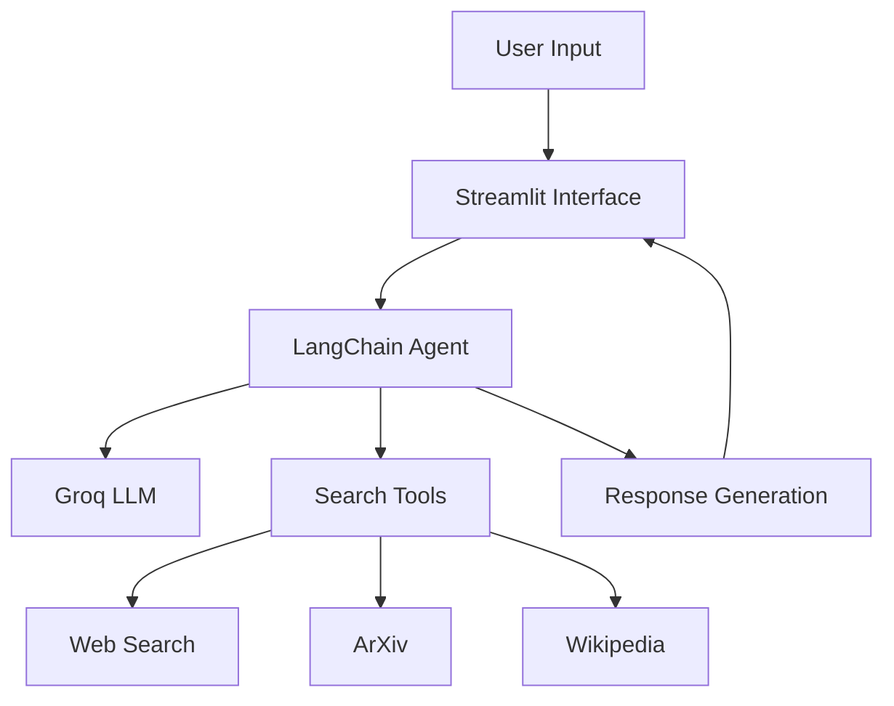

# AI Research Assistant with Multi-Source Search Capabilities

## Overview
A powerful AI assistant that combines Groq's high-performance LLMs with multi-source search capabilities (web, academic papers, and Wikipedia) through LangChain agents.

## Features
- **Multi-Source Search**: Simultaneously query web, academic papers (ArXiv), and Wikipedia.
- **High-Performance AI**: Powered by Groq's ultra-fast LLMs (70B parameter models).
- **Conversational Interface**: Natural chat-based interaction with memory.
- **Transparent Citations**: View sources for all information provided.
- **Configurable Search**: Control number of results and content length.


## Usage
Run the Streamlit app:
```bash
streamlit run app.py
```
Interact with the assistant through the web interface:
- Enter questions in the chat input.
- View the AI's thought process and sources.
- Adjust settings in the sidebar.

## Configuration
Customize the assistant through the sidebar:
- **Model Selection**: Choose between different Groq LLMs.
- **Max Results**: Control how many results to fetch per source.
- **Chat History**: Clear conversation history when needed.

## System Architecture


## Requirements
- Python 3.8+
- Streamlit
- LangChain
- Groq Python Client
- python-dotenv


